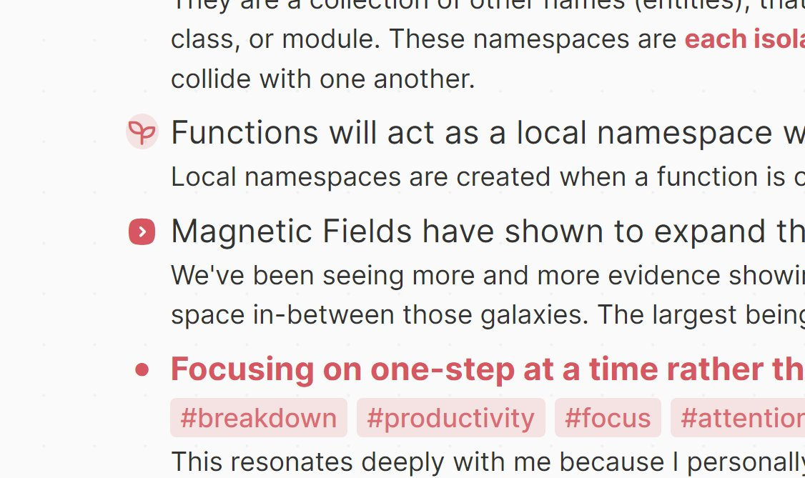
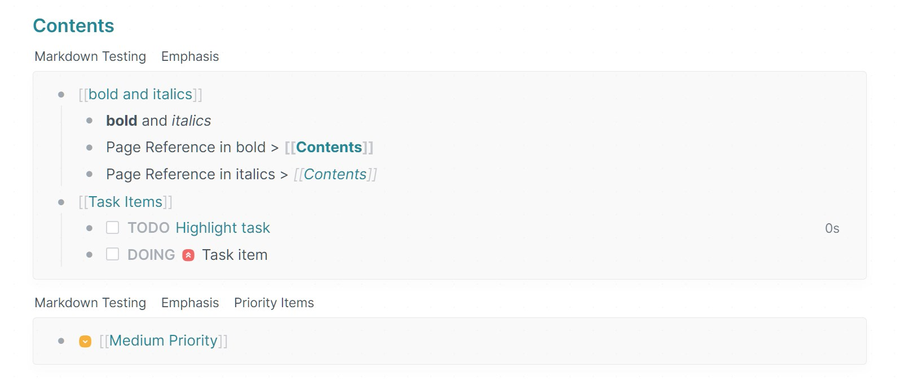
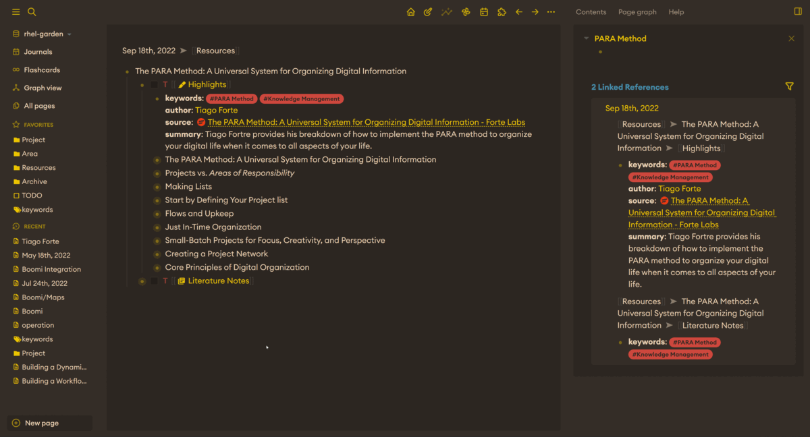
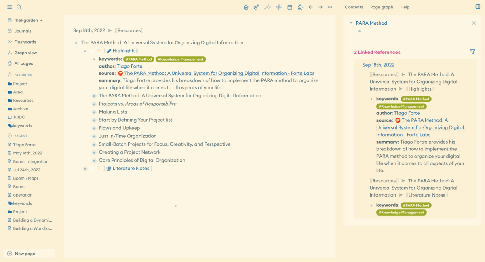

# 🧠 Logseq Flow Theme
A minimal theme that focuses on a clean and sleek interface that's soft on the edges and comes with a large variety of color palettes.

# 🚀 Features

## Custom Bullets
Bullets in Flow will use the tabler-icons fonts to render bullets. What this means is that you can easily swap out bullets with a custom icon when the block contains page-references that match a particular keyword.


### Customizing Bullets:
Bullets can now be customized to represent whatever tabler-icon you would like. Just add the following to your custom.css and replace "REPLACEME" with whatever page-reference you would like to target, and replace the hex code in `content: "\HEX"` with the hex code from the tabler-icons set. For a list of icons check https://tabler-icons.io/.
```css
  .ls-block[data-refs-self*='"REPLACEME'] > .flex.flex-row.pr-2 .bullet-container .bullet:before {
    content: "\edcd" !important;
    font-family: 'tabler-icons240';
    color: hsl(var(--cl-primary), 0.95);
    background-color: hsl(var(--cl-primary), 0.15);
    border-radius: 50%;
  }
  .ls-block[data-refs-self*='"REPLACEME']>.flex.flex-row.pr-2>.block-control-wrap a>.bullet-container.bullet-closed>.bullet:before {
    background-color: var(--ls-block-bullet-border-color);
  }
```

## Panels
Panels are grouped together by their breadcrumbs. What this means is that you'll no longer see an entire document use the same background color throughout the entire document. Instead they are now broken out into groups by the parent block:


## ⚙️ Custom Settings
The custom.css file can take the following options to tweak the visuals. Valid color options you can specify are `--cl-primary`, `--cl-secondary`, or `--cl-accent`. 
```css
:root {
  --cl-page-width: 900px;
  --cl-page-max-width: 100%;
  --cl-checkbox-background: hsl(var(--cl-accent), 0);
  --cl-checkbox-border: 1.7px;
  --cl-checkbox-radius: 2px;
  --cl-checkbox-opacity: 1;
  --cl-marker-color: var(--cl-primary);
  --cl-marker-pre-size: 0px;
  --cl-marker-size: 16px;
  --cl-mark-decoration: none;
  --cl-mark-background-color: var(--cl-primary), 0.0;
  --cl-mark-color: hsl(var(--cl-primary));
  --cl-tag-border: 10px;
  --cl-tag-color: var(--cl-text-color), 0.85;
  --cl-tag-background-color: var(--cl-text-color), 0.1;
  --cl-children-left-border: transparent;
  --cl-children-border-color: hsl(var(--cl-text-color), 0.15);
  --cl-selected-background-color: var(--cl-primary), 0.1;
  --cl-selected-color: var(--cl-primary), 1;
  --cl-font-family: "Euclid Circular A";
  --cl-header-font: "Roboto Slab";
  --cl-title-font: "Roboto Slab";
}
```

## 🚀 Features
- Clean stylish theme that focuses on simplicity rather than flashy
- Curved edges over jagged edges
- Reference Panels Style around each match rather than each document
- Improved block ref styling




## 🎨 Adding Color Palettes

For the time being if you have a color palette you would like to see added, then simply [open an issue](https://github.com/nmartin84/logseq-flow/issues/new) under this repository and provide a link to the color palette or any examples you may have with your request.

# ⌨️ Installation
From Marketplace:
- Open the Plugin Section
- Click on the marketplace
- Select the Themes option
- Click install for the "Logseq Flow" theme
- Now press `ti` to bring up the theme selection window and select one of the many color palettes

Manually:
- Clone or Download the latest [release](https://github.com/nmartin84/logseq-flow/releases)
  - If downloaded unpack the ZIP contents to a safe location
- In logseq enable the developer mode
- Open the Plugin Manager window
- Click on "Load unpacked plugin"
- Navigatge to the folder you either cloned or unpacked

## Thanks
- [Tabler Icons](https://github.com/tabler/tabler-icons)